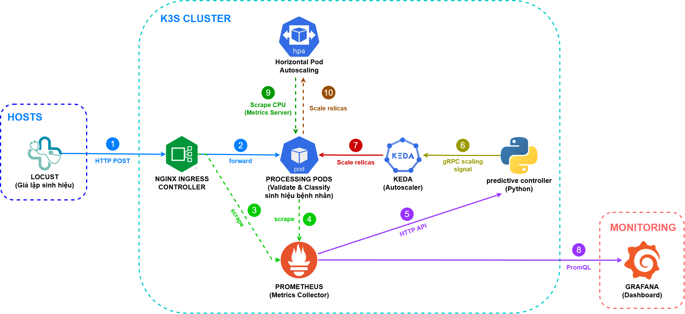

<div align="center">
  <h1>🏥 ĐÁNH GIÁ HIỆU NĂNG MẠNG CỦA CÁC CƠ CHẾ CẤP PHÁT TÀI NGUYÊN TRONG HỆ THỐNG XỬ LÝ DỮ LIỆU SINH HIỆU THỜI GIAN THỰC</h1>
  <p><b>Học phần: NT531 - Đánh giá hiệu năng hệ thống mạng máy tính</b></p>
  <p><i>Trường Đại học Công nghệ Thông tin, ĐHQG-HCM</i></p>
  <p><i>Giảng viên hướng dẫn: ThS. Đặng Lê Bảo Chương</i></p>

  [](https://kubernetes.io/)
  [](https://www.python.org)
  [](https://locust.io/)
  [](https://prometheus.io/)
  [](https://grafana.com/)
</div>

---

Repository này cung cấp toàn bộ testbed (mã nguồn, cấu hình tự động hóa) và dữ liệu thực nghiệm phục vụ việc đánh giá hiệu năng tầng mạng (Network Performance) của các hệ thống Microservice y tế thời gian thực (Internet of Medical Things - IoMT) khi phải đối mặt với các kịch bản lưu lượng biến động mạnh.

---

## 📖 Tóm tắt Đồ án

Hệ thống theo dõi sức khỏe thời gian thực yêu cầu độ trễ (End-to-End Latency) cực thấp và nghiêm ngặt (P99 < 200ms) để không bỏ lỡ các cảnh báo nguy kịch của bệnh nhân. Khi có biến động số lượng thiết bị kết nối, hệ thống cần nhanh chóng mở rộng tài nguyên để xử lý. 

Đồ án này thực nghiệm, đo lường và so sánh hiệu năng của **3 chiến lược cấp phát tài nguyên** khi xử lý dòng traffic sinh hiệu y tế:
1. **Static Provisioning**: Cấp phát tĩnh (baseline k=2, 4, 6, 8 pods).
2. **Reactive Scaling (HPA)**: Mở rộng thụ động dựa trên ngưỡng CPU (CPU > 50%).
3. **Proactive Scaling (KEDA + Custom Controller)**: Mở rộng chủ động, sử dụng thuật toán custom controller dựa trên tín hiệu lưu lượng (RPS) để scale pod trước khi CPU bão hòa.

Đặc biệt, đồ án được đối chiếu với **mô hình lý thuyết hàng đợi M/G/k (Xấp xỉ Kimura)** và áp dụng các kiểm định thống kê (Kruskal-Wallis, Cohen's d) để chứng minh mức độ hiệu quả của từng thuật toán.

**🔥 Kết quả nổi bật:** Proactive Scaling (KEDA + Controller) giúp giảm **33% độ trễ P95** và **50% tỷ lệ lỗi** so với HPA trong kịch bản tải đột biến (Spike).

---

## 🏛️ Kiến Trúc Hệ Thống (System Architecture)

<div align="center">
  
</div>

---

## 📂 Tổ chức Thư mục (Project Structure)

```text
├── src/                        # 💻 Mã nguồn Service & Custom Tools
│   ├── target-app/             # Ứng dụng SUT (FastAPI + Prometheus metrics)
│   ├── load-generator/         # Công cụ sinh tải Locust và Script phân tích dữ liệu (Python)
│   └── proactive-controller/   # Custom Controller Python tính toán và trigger KEDA
│
├── deploy/                     # ☸️ Kubernetes Manifests (k3s / AKS)
│   ├── infrastructure/         # Scripts khởi tạo testbed
│   ├── observability/          # Stack giám sát (Prometheus, Grafana, Metrics Server)
│   ├── chaos/                  # Kịch bản LitmusChaos: Kill 50% Pods
│   └── strategies/             # Manifests cho 3 chiến lược: Static, HPA, KEDA
│
├── data/                       # 📊 Dữ liệu thô (Raw metrics & Locust output CSV)
│   ├── kb0_calibration/        # Tìm tham số M/G/k và kiểm định hệ thống
│   ├── kb1_static/             # Kết quả chạy Baseline
│   ├── kb2_reactive/           # Kết quả độ trễ HPA
│   ├── kb3_proactive/          # Kết quả độ trễ KEDA
│   ├── kb4_sensitivity/        # Đánh giá Sensitivity của Threshold KEDA
│   └── math_profile/           # Dữ liệu đối chiếu lý thuyết M/G/k
│
└── results/                    # 📈 Biểu đồ trực quan hóa kết quả (Generated Plots)
    └── figs/                   # Chứa các file ảnh (PNG) từ quá trình phân tích
```

---

## 🔬 4 Kịch bản Thực nghiệm (Scenarios)

1. **KB1 - Static Baseline:** Cố định số lượng Pod (k=2, 4, 6, 8) nhằm tìm ra giới hạn của hệ thống và đối soát với mô hình lý thuyết.
2. **KB2 - Reactive Scaling:** Đánh giá độ trễ và thời gian phục hồi (MTTR) khi sử dụng HPA truyền thống dựa trên CPU.
3. **KB3 - Proactive Scaling & Chaos:** Đánh giá giải pháp KEDA + Controller mới, kết hợp kịch bản đứt gãy mạng (Chaos Engineering) để kiểm tra tính bền vững.
4. **KB4 - Sensitivity Analysis:** Đánh giá mức độ nhạy cảm của hệ thống đối với tham số Threshold của KEDA (2.0 vs 4.0 vs 6.0 RPS/Pod).

---

## ⚡ Các Chỉ số Đo lường Chính (KPIs)

- **End-to-end Latency (P50/P95/P99):** Độ trễ tổng thể của gói tin trên mạng lưới.
- **Queueing Delay:** Ước lượng thời gian chờ trong hàng đợi mạng.
- **Throughput (req/s) & Error Rate (%):** Khả năng chịu tải trước khi bị nghẽn mạch (HTTP 503/504).
- **MTTR (Mean Time To Recovery):** Thời gian đưa P99 Latency về lại dưới 200ms sau cú sốc tải.

---

## 🚀 Hướng dẫn Chạy (Quick Start)

**1. Yêu cầu hệ thống:**
- Cụm Kubernetes đang chạy (Khuyên dùng `k3s`).
- Python 3.10+ và các thư viện trong `requirements.txt`.
- Helm & kubectl.

**2. Khởi tạo Kịch bản Tải (Load Generation):**
Thay vì dựng cả cụm k8s, bạn có thể kiểm tra trước luồng traffic sinh hiệu mô phỏng bằng cách bật Mock Server:
```bash
cd src/load-generator
pip install -r requirements.txt
python mock_server.py
```
Mở một Terminal khác để bắn tải mô phỏng "Spike" (tăng vọt lên 100 thiết bị):
```bash
# Trên PowerShell
$env:PROFILE="spike"; locust -f locustfile.py --host http://localhost:8000 --headless
```

**3. Phân tích Dữ liệu Tự động:**
Chạy script phân tích tự động để tạo lại các biểu đồ báo cáo:
```bash
python src/load-generator/analysis/plot_final_comparison.py
```

---

## 👨‍💻 Nhóm Thực hiện (Nhóm 02)

| Họ và Tên | MSSV | Profile GitHub |
|---|:---:|---|
| Bùi Đặng Nhật Nguyên | `23521037` | [@double-n-021](https://github.com/double-n-021) |
| Nguyễn Minh Quyền | `23521325` | [@Minh-Quyen-uit](https://github.com/Minh-Quyen-uit) |
| Võ Trung Kiên | `23520809` | [@VoTrungKien-23520809](https://github.com/VoTrungKien-23520809) |
